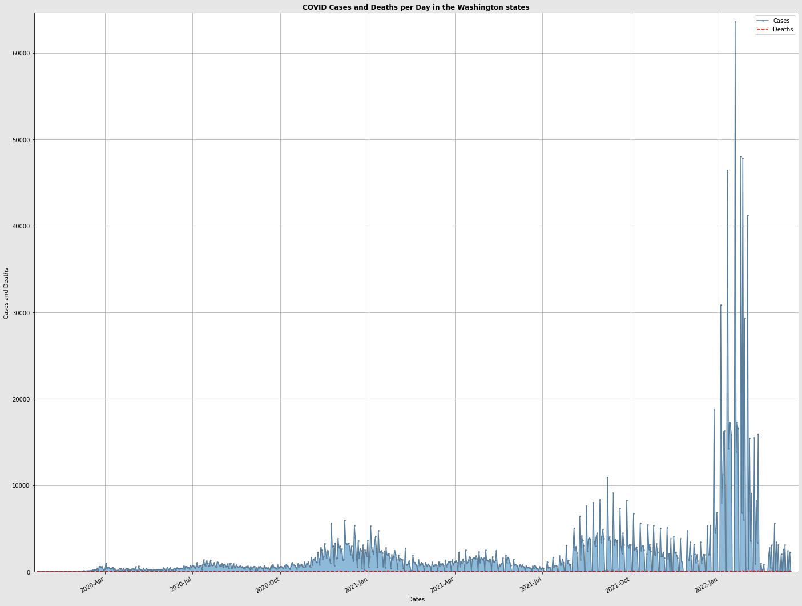
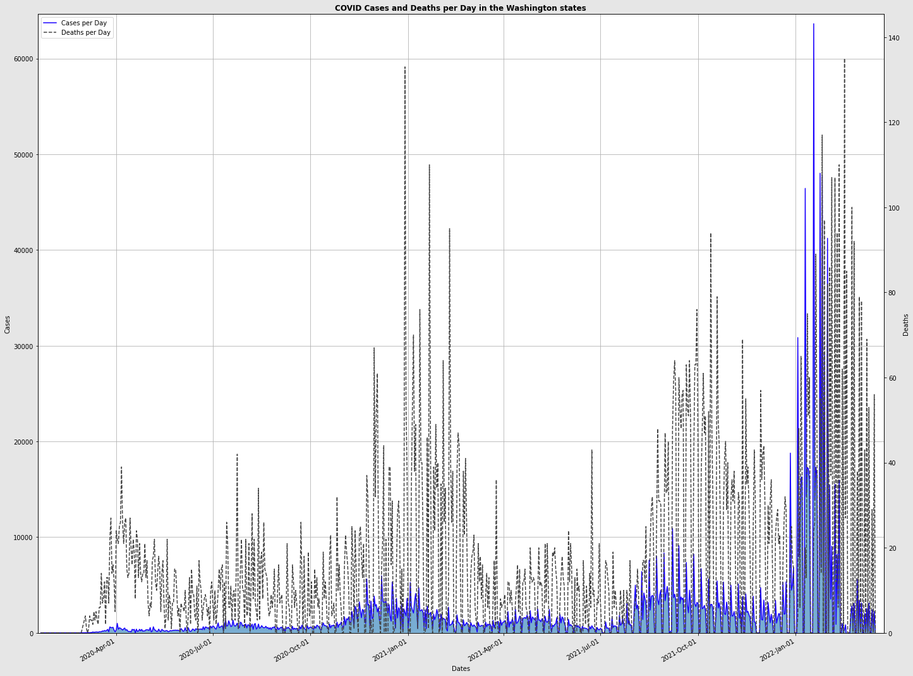
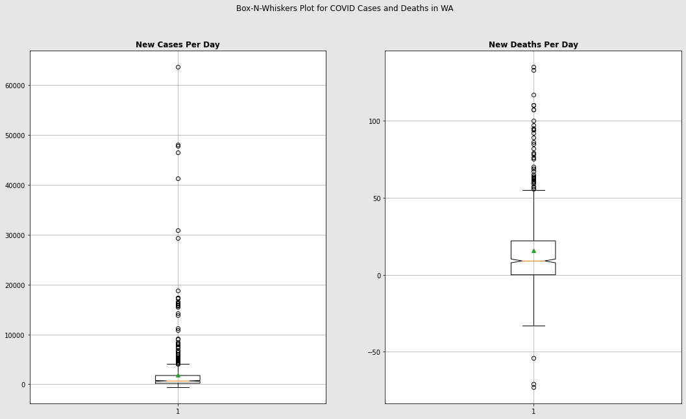

# COVID Data Visualization
A demonstration on data visualization using matplotlib, seaborn, and python using COVID data. (CLI)

The data used in this project is from [The New York Times](https://github.com/nytimes/covid-19-data/blob/master/rolling-averages/us-states.csv).
   - COVID-19 data from: 2020-01-21 until 2022-03-24
   
Line Chart Generated:

Line Chart (Scaled) Generated:

Box Plot Generated:

## License, copyright & DISCLAIMER
THIS SOFTWARE IS “<ins>IN NO EVENT SHALL THE COPYRIGHT HOLDER OR CONTRIBUTORS BE LIABLE</ins> FOR ANY DIRECT, INDIRECT, INCIDENTAL, SPECIAL, EXEMPLARY, OR CONSEQUENTIAL DAMAGES (INCLUDING, BUT NOT LIMITED TO, PROCUREMENT OF SUBSTITUTE GOODS OR SERVICES; LOSS OF USE, DATA, OR PROFITS; OR BUSINESS INTERRUPTION) HOWEVER CAUSED AND ON ANY THEORY OF LIABILITY, WHETHER IN CONTRACT, STRICT LIABILITY, OR TORT (INCLUDING NEGLIGENCE OR OTHERWISE) ARISING IN ANY WAY OUT OF THE USE OF THIS SOFTWARE, EVEN IF ADVISED OF THE POSSIBILITY OF SUCH DAMAGE.”

Any academic dishonesty associated with this project has no liability with the author of this project. For more information, please refer to the [BSD-3 LICENSE](https://github.com/FlashSonic526/COVID-Data-Visualization/blob/main/LICENSE).